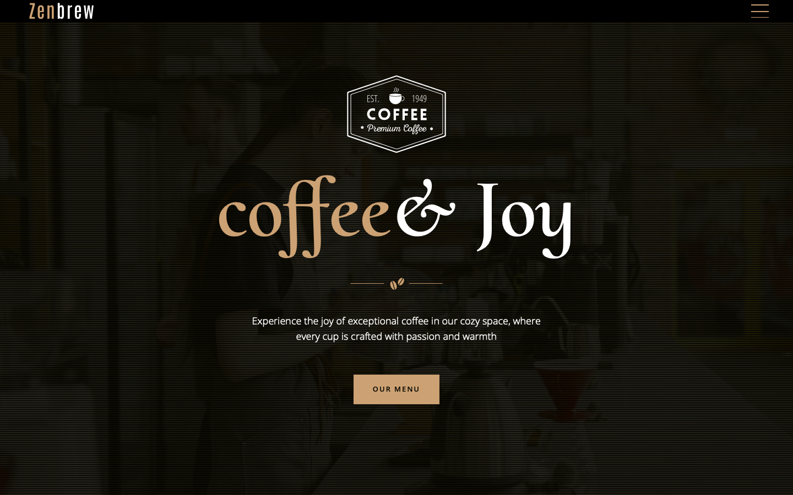

# ☕ Coffee & Joy



A responsive and visually appealing coffee-themed landing page built with modern web technologies. This project combines smooth animations with sleek design to showcase coffee products dynamically and professionally.

## 🛠️ Tech Stack

- **React** - UI library
- **Next.js** - React framework
- **Tailwind CSS** - Utility-first CSS framework
- **Framer Motion** - Animation library
- **GSAP** - Professional animation library

## 🚀 Quick Start

### Prerequisites

Ensure you have the following installed:

- [Git](https://git-scm.com/)
- [Node.js](https://nodejs.org/) (v16 or higher)
- npm or yarn

### Installation

1. **Clone the repository**
   ```bash
   git clone git@github.com:Damiduuxd/coffee_landing_page.git
   cd coffee_landing_page
   ```

2. **Install dependencies**
   ```bash
   npm install
   ```

3. **Set up environment variables**
   
   Create a `.env.local` file in the root directory:
   ```env
   NEXT_PUBLIC_EMAILJS_SERVICE_ID=your_service_id
   NEXT_PUBLIC_EMAILJS_TEMPLATE_ID=your_template_id
   NEXT_PUBLIC_EMAILJS_USER_ID=your_user_id
   NEXT_PUBLIC_GOOGLE_API_KEY=your_google_api_key
   NEXT_PUBLIC_PLACE_ID=your_place_id
   ```
   
   > **Note:** Replace the placeholder values with your actual keys from [EmailJS](https://www.emailjs.com/) and [Google Maps Platform](https://developers.google.com/maps).

4. **Start the development server**
   ```bash
   npm run dev
   ```
   
   Open [http://localhost:3000](http://localhost:3000) to view the project.

## 📁 Project Structure

```
coffee_landing_page/
├── app/
│   ├── aboutus/
│   ├── components/
│   └── ...
├── public/
│   ├── assets/
│   └── bg.png
├── .env.local
└── package.json
```

## 🎨 Features

- ✨ Smooth animations and transitions
- 📱 Fully responsive design
- ☕ Coffee-themed UI components
- 📧 Contact form integration
- 🗺️ Google Maps integration
- 🎭 Interactive elements


Contributions are welcome! Please feel free to:

- 🐛 Report bugs
- 💡 Suggest new features
- 🔧 Submit pull requests


---

Made with ☕ and ❤️ by [Damiduuxd](https://github.com/Damiduuxd)
